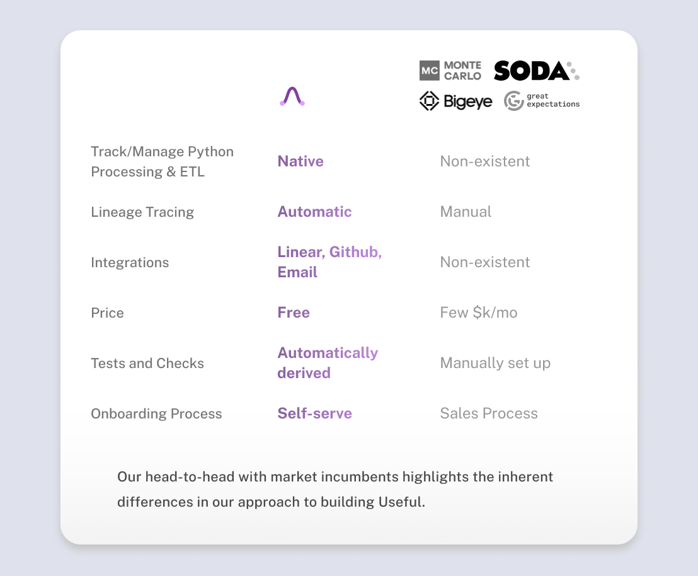

# useful


---

We are building Useful to be adored by Python developers and modern data engineering teams.



Useful is **very** different from market incumbents. And we have an exciting roadmap ahead…

---
But first:

We created Useful to streamline ETL and data drift resolution without sacrificing deployment pace or spending time test writing.

At a glimpse, Useful encompasses:

- ***Anomaly detection on your Python code***
- ***Automated ETL testing and notifications***
- ***Observability across all code changes, argument changes, and workflows within your ETL***
- ***Comparisons of new ETL developments against production runs***
- ***… and much more***

*All with one line of code.*

Here’s how it works:

1. Starting with a Python ETL, include Useful checks in your code with a simple decorator.

   

2. Every time your code runs, Useful logs your functions' information, allowing you to observe each function's behavior through its interface.

   

3. Utilize the interface to explore statistics in depth, collaborate with your team to troubleshoot anomalous data, and save important statistics with bookmarks and notifications.

   

Each Useful Check logs:

1. Runtime statistics of the function
2. Statistics of the function’s return, auto-adapting to the return dtype of the function
3. Code and arguments fed to the function
4. Where the function is within the traceback to define a bullet-proof function hierarchy
5. Git information and workflow placement of jobs

**users can disable any particular logging for a function.*

Then, behind the scenes, thousands of statistics are processed every second to identify anomalies and share results in the Useful dashboard.

Our simple Python integration combines with a 2024-ready UI that lets you easily see everything in your ETL and pin down critical data drift at scale.


We take privacy very seriously. The data ingested into Useful is core to your business, and we treat it as such.

## Installation

To install Useful, you can run:

```bash
poetry add useful-machines
```

```bash
pip install useful-machines
```

For the library to work successfully and to access the Useful tool, please reach out to us at <liam@levelvc.com>.
